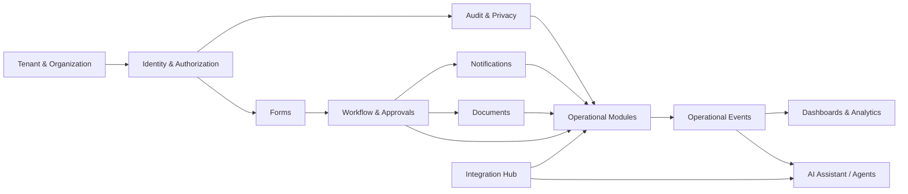

# Implementation Plan

## Delivery objective

Produce a real pilot MVP in approximately six months with a focused, experienced team, then reach a commercially supportable V1 in nine to twelve months. A smaller team can execute the same sequence, but the scope or timing must change; quality and security gates must not be removed.

## Workstreams

| Workstream | Scope | Lead |
|---|---|---|
| Product discovery | Process research, customer journeys, scope, pricing hypotheses, pilot outcomes | Product Lead |
| Experience and design system | UX research, accessibility, design system, role navigation, prototypes | Design Lead |
| Platform foundation | Tenancy, identity, authorization, forms, workflow, notifications, documents, audit | Principal Engineer |
| Branch/customer flow | Services, booking, queue, check-in, branch console, status and feedback | Product/Engineering Lead |
| Workforce | Employee core, attendance, leave, basic schedules and onboarding | Product/Engineering Lead |
| Internal operations | Request catalogue, approvals, service desk, policies and facilities | Product/Engineering Lead |
| Data and analytics | Event model, dashboards, metrics definitions, warehouse path | Data Lead |
| Integrations | APIs, webhooks, provider adapters, imports and enterprise connectors | Integration Lead |
| Security/privacy/compliance | Threat models, isolation, SDLC, NDPA controls, retention, incident readiness | Security/Privacy Lead |
| Reliability and delivery | Environments, CI/CD, observability, SLOs, backups, DR and support tooling | Platform/SRE Lead |
| Pilot implementation | Configuration, migration, training, rollout, adoption and measurement | Implementation Lead |

## Phase 0 — Discovery and executable design (Weeks 1–8)

### Goals

- Confirm three high-frequency, painful administrative journeys.
- Select two design partners in at least two target sectors.
- Lock MVP boundaries and measurable pilot targets.
- Prove technical risks before feature production.

### Deliverables

- Fifteen or more stakeholder interviews.
- Current-state and future-state maps for customer visit, employee time/leave and internal request.
- Service blueprint showing human and system handoffs.
- Clickable prototypes for customer, employee, manager and branch roles.
- Canonical object model and tenant-isolation decision.
- Initial threat model, privacy data map and retention classes.
- Architecture ADRs and monorepo skeleton.
- Provider proof-of-concepts for messaging, identity and payment only where MVP requires payment.
- Pilot contracts or letters of intent with success measures.

### Exit gate

Do not start broad feature production until the team can demonstrate the complete journeys, identify systems of record, define buyer value and explain what is not in MVP.

## Phase 1 — Platform foundation (Weeks 9–16)

### Build

- Tenant, organization, branch, department and role administration.
- Identity provider integration, MFA, session controls and authorization service.
- Shared design system and application shells.
- Form definition/submission engine.
- Workflow runtime with approvals, timers, escalation and audit.
- Notification provider abstraction and template service.
- Document storage, classification and malware-scanning pipeline.
- Audit event model and privileged-action logging.
- API conventions, idempotency, feature flags and entitlement checks.
- CI/CD, test environments, secrets, observability, backup and restore automation.

### Exit gate

A test tenant can be provisioned automatically; users can be invited and restricted by branch/role; a configurable form can create a workflow; notifications can be sent; every action appears in audit; cross-tenant tests pass.

## Phase 2 — End-to-end vertical slices (Weeks 17–28)

### Customer/branch slice

- Service catalogue and branch capability.
- Appointment booking/rescheduling/cancellation.
- Pre-visit forms and document readiness.
- Remote and branch check-in.
- Real-time queue with transfer, recall and no-show.
- Customer status and notifications.
- Branch live-floor dashboard.

### Workforce slice

- Employee master record and organization directory.
- Clock-in/out with offline capture and correction workflow.
- Leave request and approval.
- Basic schedule/shift view.
- Employee and manager dashboards.

### Internal-operations slice

- Request catalogue.
- Approval and fulfilment workflows.
- Internal service desk with SLA.
- Documents, policies and acknowledgement.
- Workflow/SLA dashboard.

### Exit gate

The three north-star journeys run end-to-end in staging using production-like integrations, permissions and telemetry. No manual database changes are required to complete a normal case.

## Phase 3 — Pilot readiness and live pilot (Weeks 29–40)

### Hardening

- Data migration tools and validation reports.
- Low-bandwidth tuning and offline reconciliation.
- Accessibility testing and localization foundation.
- Load, failover, tenant-isolation and penetration testing.
- Support console with time-limited audited tenant access.
- Incident response, provider-failure and branch-continuity runbooks.
- User training, administrator training and in-product guidance.
- Pilot dashboards and baseline measurements.

### Pilot design

- Start with two or three branches/locations and a controlled employee group.
- Run old and new processes in parallel only for a time-boxed validation period.
- Review operational data daily in the first two weeks.
- Track wait time, no-shows, attendance corrections, approval cycle time, SLA breaches and active usage.
- Maintain a defect/feedback triage with severity and product decision owner.

### Exit gate

Pilot objectives are met or the gap is understood; no unresolved critical security/privacy issue remains; support and recovery procedures have been exercised; pilot users can operate without daily engineering intervention.

## Phase 4 — Commercial V1 (Weeks 41–52)

### Add

- Automated tenant provisioning, plans, quotas and subscription administration.
- Kiosk/signage experience and managed-device mode.
- Improved shifts, onboarding/offboarding and facilities requests.
- Knowledge centre and basic CRM/customer record.
- Implementation templates and industry demo tenants.
- Public API keys/OAuth clients, webhook administration and integration monitoring.
- Customer onboarding checklist, support SLAs and status communication.
- Security review package, data-processing terms and compliance evidence set.

### Commercial exit gate

A new standard customer can be configured by an implementation team without code changes, trained through documented materials and supported using defined SLAs, telemetry and runbooks.

## Phase 5 — Expansion suite (Months 12–24)

- Applicant tracking and skills assessments.
- Structured interview studio, initially without automated scoring.
- Performance and goals.
- Procurement, vendors, assets, expenses and contracts.
- CRM, invoices/payments and omnichannel communication centre.
- Industry packs, partner portal and connector marketplace foundations.
- Enhanced tenant isolation options and enterprise SSO.

## Phase 6 — Intelligence and international enterprise (Months 18–36)

- Forecasting and capacity optimization.
- Process mining and bottleneck analysis.
- Enterprise AI assistant with source-grounded answers.
- Anomaly/fraud signals with human investigation.
- Governed AI agents for low-risk actions.
- Dedicated deployment/data-region options.
- Advanced resilience, marketplace and country compliance packs.

## Dependencies that control sequence

AI interviews and autonomous operations are deliberately downstream of identity, workflow, audit, consent, reliable event data and human-review controls.

## Recommended team

### Serious MVP team: approximately 18–22 people

- 1 product lead
- 1 delivery/project lead
- 2 product designers/researchers
- 1 principal architect/technical lead
- 4 backend engineers
- 3 web frontend engineers
- 2 mobile/PWA engineers
- 2 QA/automation engineers
- 1 platform/SRE engineer
- 1 security/privacy engineer or dedicated consultant with engineering participation
- 1 data/analytics engineer
- 2 implementation/support specialists

Specialist legal, accessibility, penetration-testing and industry advisers may be fractional.

### Lean team: approximately 9–12 people

Use the same architecture but reduce the first release to customer booking/queue, employee attendance/leave and one approval/service-desk flow. Expect commercial V1 closer to twelve to eighteen months.

## Delivery cadence

- Two-week development iterations.
- Weekly product/design/engineering triad review.
- Fortnightly pilot/design-partner review during active discovery and pilot.
- Six-week release train with a stabilization window.
- Monthly security/privacy review.
- Quarterly architecture and roadmap review.

## Control against scope expansion

Every new request must state:

1. The user and operational problem.
2. The measurable outcome.
3. The release it belongs to.
4. The shared services and domain owner.
5. Whether configuration can solve it.
6. Privacy/security classification.
7. What current commitment is removed or delayed if it is added.
