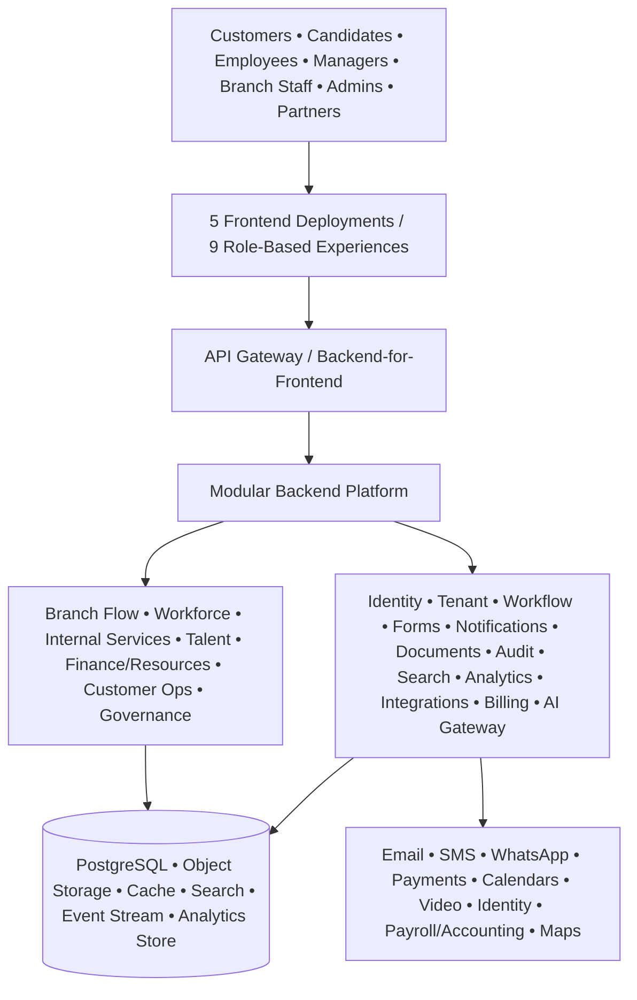

# AdminOps OS — Project Execution Repository

> Working product category: **Administrative Operations Operating System**  
> Proposed product name from the strategy report: **KoraNerve One** (not final; trademark and domain clearance required).

AdminOps OS is a multi-tenant platform for organizations to coordinate customer visits, queues, employees, approvals, internal services, documents, hiring, resources, analytics and governed AI from one operational foundation.

The central rule is simple:

> **Do not build 50 disconnected applications. Build one secure platform, then expose modular capabilities through role-based experiences.**

## Target product shape

- **1 shared SaaS platform**
- **7 commercial solution packs** plus the core platform
- **50 modular capabilities**
- **9 role-based user experiences**
- **5 deployable frontend applications**
- **1 shared backend platform**, beginning as a modular monolith
- **13 core platform services**
- **16 dashboards in the MVP/commercial foundation**
- **28+ dashboards at platform maturity**

## User experiences

| # | User experience | Primary users | Main responsibility | Initial delivery |
|---:|---|---|---|---|
| 1 | Customer Portal & PWA | Customers, visitors, members | Appointments, queues, forms, cases, documents, payments, feedback | MVP |
| 2 | Candidate & Interview Portal | Applicants, assessors | Applications, scheduling, assessments, interviews, consent, status | Expansion |
| 3 | Employee App | Employees, contractors | Clock-in/out, shifts, leave, requests, tasks, knowledge, profile | MVP |
| 4 | Manager & Executive Workspace | Supervisors, managers, executives | Approvals, team capacity, SLA, performance, analytics, command centre | MVP |
| 5 | Branch Operations Console | Reception, tellers, service staff, security | Walk-ins, live queues, transfers, visitors, branch readiness | MVP |
| 6 | Kiosk & Digital Signage | Walk-in customers and visitors | Check-in, ticketing, wayfinding, queue display, accessibility | Commercial V1 |
| 7 | Organization Admin Studio | HR, operations, IT, compliance, tenant administrators | Organization setup, roles, workflows, forms, policies, reports, subscriptions | MVP |
| 8 | Platform Super Admin Control Plane | SaaS operations, support, security, finance | Tenants, plans, usage, incidents, provider health, support access, abuse controls | MVP |
| 9 | Partner & Developer Portal | Implementers, resellers, developers | APIs, webhooks, connectors, sandbox tenants, marketplace and certifications | Expansion |

The nine experiences should not become nine independent technology stacks. The recommended deployment structure is:

| Deployable frontend | Experiences included | Recommended technology direction |
|---|---|---|
| Public Experience PWA | Customer Portal + Candidate Portal | Next.js/React/TypeScript PWA, responsive and low-bandwidth-first |
| Workforce App | Employee App | Expo/React Native with web support; offline attendance and request drafts |
| Operations Web | Manager/Executive Workspace + Branch Console | Next.js/React/TypeScript with real-time updates |
| Administration Web | Organization Admin + Platform Admin + Partner Portal | Next.js/React/TypeScript with strict permission boundaries and separate routes/deployments where required |
| Kiosk/Signage App | Kiosk + queue displays | Locked-down PWA first; managed Android/native shell only where device control requires it |

## Product packaging

| Product layer | Purpose | Modules |
|---|---|---|
| Core Platform & Trust | The reusable SaaS foundation every pack depends on | 39, 40, 43, 44, 45, 48 |
| Branch & Customer Flow | Remove queues, failed visits and customer uncertainty | 1–10 |
| Workforce Administration | Coordinate staff identity, time, availability and lifecycle | 11–15, 19–20 |
| Talent & Recruitment | Manage applications, assessments and structured interviews | 16–18 |
| Internal Services & Collaboration | Move requests, documents, tasks, facilities and knowledge | 21–25, 30, 37 |
| Procurement, Finance & Resources | Control purchasing, vendors, assets, expenses, billing and contracts | 26–29, 33–34 |
| Customer, Revenue & Knowledge Operations | Unify customer records, complaints, communication and experience | 31–32, 35–36 |
| Governance, Intelligence & Ecosystem | Analytics, AI, resilience, localization and advanced controls | 38, 41–42, 46–47, 49–50 |

## Recommended first commercial offer

Launch three connected outcome-based packs on one core:

1. **Branch & Customer Flow** — appointments, remote queueing, pre-visit forms, check-in, notifications and case status.
2. **Workforce Administration** — employee records, attendance, leave, basic schedules and onboarding/offboarding.
3. **Internal Operations** — requests, approvals, service desk, documents, policies, facilities and operational dashboards.

Recruitment, AI interviewing, procurement, full CRM, billing, process mining and autonomous agents follow after the platform has mature identity, workflow, audit, privacy and integration foundations.

## First twelve capability bundles

1. Tenant, organization, branch and role administration.
2. Identity, authentication, MFA and permission engine.
3. No-code forms and core workflow/approval engine.
4. Omnichannel notification service.
5. Smart appointment scheduling.
6. Virtual queue, remote check-in and branch console.
7. Pre-visit forms and customer status portal.
8. Employee master records.
9. Time, attendance, leave and basic shifts.
10. Internal service desk and request catalogue.
11. Document/policy management and audit trail.
12. Operational dashboards and integration APIs.

## Architecture summary

Start with a **modular monolith** and clear domain boundaries. Extract services only when load, resilience, isolation or team ownership creates a proven need.

## Repository documentation

Start with [Documentation Index](docs/00_DOCUMENTATION_INDEX.md), then read:

1. [Product Vision and Scope](docs/01_PRODUCT_VISION_AND_SCOPE.md)
2. [Apps and Dashboards](docs/02_APPS_AND_DASHBOARDS.md)
3. [Product Requirements](docs/03_PRODUCT_REQUIREMENTS.md)
4. [Implementation Plan](docs/04_IMPLEMENTATION_PLAN.md)
5. [Roadmap and Releases](docs/05_ROADMAP_AND_RELEASES.md)
6. [System Architecture](docs/06_SYSTEM_ARCHITECTURE.md)
7. [Initial Backlog](docs/18_INITIAL_BACKLOG.md)

## MVP success definition

The pilot succeeds when real organizations can complete three end-to-end journeys without spreadsheet or paper duplication:

- A customer books, prepares, checks in, joins a queue, receives service and tracks the resulting case.
- An employee clocks in, sees the shift, submits leave or an internal request and receives a traceable decision.
- A manager sees live branch/workforce conditions, handles exceptions and measures cycle time and service outcomes.

## Explicitly outside the first release

- Core banking, lending decisions or general ledger replacement.
- Country-specific payroll calculation and tax filing.
- Autonomous candidate rejection.
- Facial, voice or body-language emotion/personality scoring.
- Broad autonomous agents with unrestricted access.
- Separate custom code forks for each customer or industry.
- Native apps for every user category before PWA usage proves the need.

## Execution status

This repository is a documentation-first implementation package. The next engineering action is to create the monorepo skeleton and convert [the initial backlog](docs/18_INITIAL_BACKLOG.md) into tracked epics and stories.
