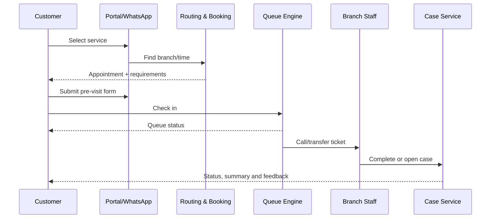
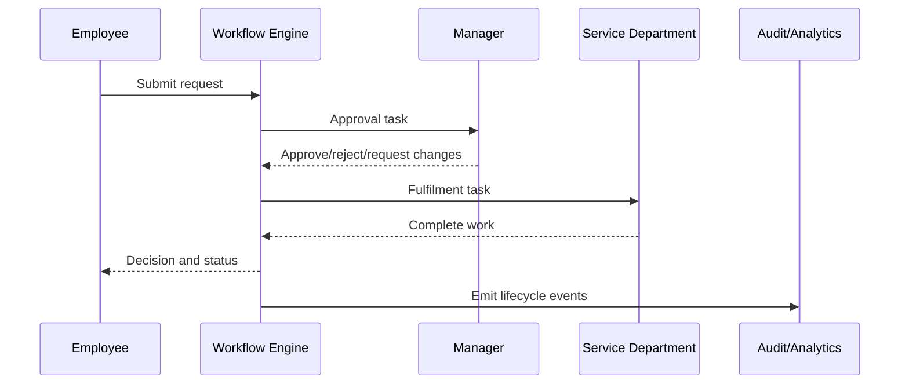

# Product Vision and Scope

## Vision

Build the operating nerve centre for organizations: a trusted platform that coordinates customer access, people, requests, records, resources and AI-assisted work.

## Product category

**Administrative Operations Operating System (AdminOps OS)** — a configurable, multi-tenant SaaS platform for day-to-day administrative operations.

It is broader than attendance, queue management or recruitment software, but it must enter the market through focused outcomes rather than a generic “everything suite.”

## Primary outcomes

| Audience | Outcome |
|---|---|
| Customers | Book, queue, submit, communicate, pay and track service without unnecessary travel or uncertainty. |
| Employees | Clock in, see schedules, request services, complete tasks, find policies and track decisions. |
| Managers | See demand, staffing, delays, risks, costs and service quality in real time. |
| Administrators | Configure organization structures, roles, forms, workflows, policies, integrations and reports. |
| Executives | Measure operational outcomes across branches and departments from one command centre. |
| Platform operator | Provision and support many customers without one-off deployments or code forks. |

## Product layers

| Product layer | Purpose | Modules |
|---|---|---|
| Core Platform & Trust | The reusable SaaS foundation every pack depends on | 39, 40, 43, 44, 45, 48 |
| Branch & Customer Flow | Remove queues, failed visits and customer uncertainty | 1–10 |
| Workforce Administration | Coordinate staff identity, time, availability and lifecycle | 11–15, 19–20 |
| Talent & Recruitment | Manage applications, assessments and structured interviews | 16–18 |
| Internal Services & Collaboration | Move requests, documents, tasks, facilities and knowledge | 21–25, 30, 37 |
| Procurement, Finance & Resources | Control purchasing, vendors, assets, expenses, billing and contracts | 26–29, 33–34 |
| Customer, Revenue & Knowledge Operations | Unify customer records, complaints, communication and experience | 31–32, 35–36 |
| Governance, Intelligence & Ecosystem | Analytics, AI, resilience, localization and advanced controls | 38, 41–42, 46–47, 49–50 |

## Shared platform services

1. Tenant and organization core.
2. Identity and authentication.
3. Authorization and access governance.
4. Form builder and submission engine.
5. Workflow, rules, tasks and approvals.
6. Omnichannel notifications.
7. Documents, templates, signatures and records.
8. Audit and operational event stream.
9. Search and knowledge retrieval.
10. Reporting, dashboards and analytics.
11. Integration hub, APIs and webhooks.
12. Subscription, usage and entitlement control.
13. Governed AI gateway and evaluation service.

## Strategic boundaries

- Integrate with payroll, accounting, core banking and specialist systems rather than replacing them first.
- Use configuration and industry packs instead of separate codebases.
- Treat employee, applicant and customer monitoring as proportionate and privacy-sensitive.
- Keep humans responsible for high-impact employment, financial, legal, disciplinary and security decisions.
- Build bank-grade controls, but validate product-market fit with faster-moving multi-branch organizations.
- Prefer mobile web/PWA and assisted channels before forcing every user to install an app.

## Initial target segments

### Tier 1 — fastest validation

Multi-branch clinics, schools/training providers, professional-service firms, retail/service chains, coworking/facility operators and growing SMEs.

### Tier 2 — strong fit

Microfinance, insurance brokers, logistics, NGOs, hospitality, property management and state/local service offices.

### Tier 3 — strategic enterprise

Commercial banks, telecoms, national government and highly regulated enterprises after security, resilience and integration maturity.

## Nigeria-first, globally reusable requirements

- Low-bandwidth pages, resumable forms and offline-tolerant workflows.
- SMS and WhatsApp provider adapters; USSD considered only where justified.
- Multi-branch routing and centralized oversight.
- Flexible identity through phone, email, staff ID, customer number, QR and enterprise SSO.
- Configurable workweeks, holidays, approval hierarchies, languages, currencies and time zones.
- Provider abstraction for payments, messaging, identity, video, accounting and payroll.
- No hard-coded Nigeria-only assumptions in the core domain model.

## North-star journeys

### Customer visit

### Employee request

## Product success definition

The platform is successful when customers can adopt one pack quickly, prove a measurable operational outcome, and add adjacent packs without duplicate identities, re-entered data, separate reporting or a new implementation project.
