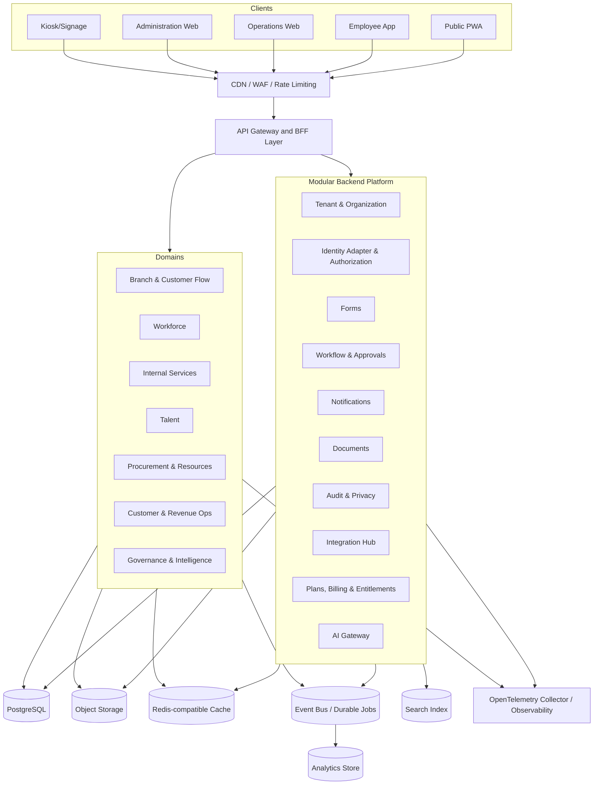
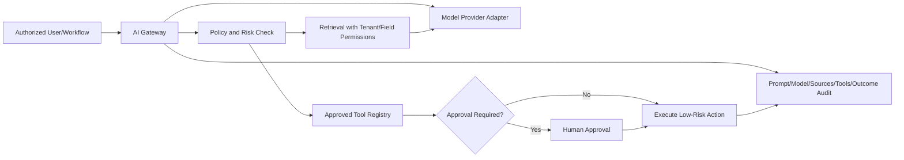

# System Architecture

## Architecture principles

1. One platform; modules share core services and object definitions.
2. Modular monolith first; extract services only with evidence.
3. Tenant isolation is independent of ordinary authentication.
4. Server-side authorization is mandatory on every access path.
5. Workflows and external actions are durable and idempotent.
6. Events are first-class for audit, analytics and integration.
7. Provider integrations are replaceable adapters.
8. Offline capture is controlled, conflict-aware and auditable.
9. AI uses controlled APIs, never unrestricted database access.
10. Operational simplicity is a feature during the first years.

## Logical architecture

## Recommended technology direction

| Layer | Direction | Reason |
|---|---|---|
| Web/PWA | Next.js, React and TypeScript | Shared design system, server rendering where useful, PWA support and broad hiring ecosystem. |
| Mobile | Expo/React Native and TypeScript | Android/iOS delivery with a shared codebase and web reuse where practical. |
| Backend | NestJS/TypeScript modular monorepo | Strong module boundaries, dependency injection, HTTP/WebSocket support and a migration path to services. |
| Operational database | PostgreSQL | Strong relational integrity, transactions, JSON where appropriate and row-level security as defence in depth. |
| Workflow durability | Temporal or equivalent durable workflow system | Long-running approvals, timers, retries and recovery should not rely on fragile cron jobs. |
| Cache/locks/realtime support | Redis-compatible managed service | Caching, rate limits, ephemeral presence and distributed coordination. |
| Object storage | Cloud object storage | Documents, media, exports, signed upload/download and lifecycle rules. |
| Search | PostgreSQL search initially; dedicated index when justified | Avoid premature infrastructure while preserving an extraction path. |
| Events | Transactional outbox + managed broker/queue | Reliable domain events, integrations and analytics without distributed-transaction coupling. |
| Analytics | Operational read models first; warehouse/lakehouse later | Protect operational performance and support cross-module history at scale. |
| Observability | OpenTelemetry | Vendor-neutral traces, metrics and logs with correlation. |
| Infrastructure | Containers/managed compute + infrastructure as code | Repeatability, portability and automated tenant/deployment operations. |

Technology choices are defaults, not excuses to bypass proof-of-concept tests for offline sync, queue concurrency, tenant isolation, workflow durability and provider reliability.

## Backend domain boundaries

### Platform modules

- tenancy
- organization
- identity-adapter
- authorization
- forms
- workflow
- notifications
- documents
- audit
- privacy
- integrations
- entitlements/billing
- analytics-eventing
- ai-gateway

### Business domains

- branch-flow
- workforce
- internal-services
- talent
- procurement-resources
- customer-revenue
- governance-intelligence

A domain owns its write model. Other domains use published application services or events; they must not directly update another domain’s tables.

## Modular-monolith extraction triggers

Extract a component only when one or more are true:

- It needs materially different scaling, such as queue realtime or notification fan-out.
- It needs stronger isolation or a separate data residency boundary.
- It has independent uptime/recovery requirements.
- A dedicated team owns it and interfaces are stable.
- Release coupling demonstrably blocks delivery.
- Technology requirements cannot reasonably be supported in the main runtime.

Likely early extraction candidates: notification delivery workers, document processing, realtime queue gateway, analytics ingestion and AI gateway. Do not extract tenant, authorization or workflow definitions casually because distributed consistency risk is high.

## Multi-tenancy model

### Standard tier

- Shared application deployment.
- Shared PostgreSQL cluster/database with `tenant_id` on all tenant-owned tables.
- Database row-level security as defence in depth.
- Application authorization validates tenant, role and attributes.
- Tenant-aware cache keys, object paths, search indexes and event metadata.

### Enhanced isolation tier

- Shared application layer with tenant-dedicated database/schema, keys, storage bucket/container or search index where required.

### Dedicated enterprise tier

- Dedicated deployment stamp and data region, still provisioned and managed through the common control plane.

### Mandatory isolation controls

- Tenant context derived from trusted authentication/host mapping, never an unverified request field alone.
- No unscoped repository/data-access methods.
- Automated cross-tenant negative tests.
- Tenant IDs included in logs/events without exposing sensitive data.
- Support access uses time-limited grants, reason, approval and audit.

## Workflow architecture

Tenant administrators configure business-level workflow definitions. The platform compiles/executes these through a controlled workflow layer.

- Definitions are versioned and validated.
- Running instances retain their original version.
- External actions use idempotency and retry policies.
- Human tasks support assignment, delegation, due dates and escalation.
- Compensation/rollback behavior is explicit for reversible actions.
- Workflow engine internals are not directly exposed to tenant users.

## Real-time queue architecture

- Authoritative ticket state is stored transactionally.
- State changes emit ordered events per branch/queue.
- WebSocket or Server-Sent Events update staff consoles and customer views.
- Displays can recover state from snapshots after reconnect.
- Estimated waits use live and historical data but are shown as ranges.
- Branch staff retain manual override with reason and audit.

## Offline model

Use offline only where the operational cost of disconnection justifies complexity:

- Employee attendance events.
- Branch/kiosk check-in.
- Draft forms and request capture.

Rules:

- Generate client event IDs and capture device/time metadata.
- Synchronize through idempotent APIs.
- Detect impossible or conflicting events.
- Never silently overwrite server truth.
- Route conflicts to an authorized correction workflow.
- Encrypt local sensitive data and expire it quickly.

## Data consistency

- Strong consistency inside a domain transaction.
- Transactional outbox for publishing committed changes.
- Eventual consistency for dashboards, search and cross-domain read models.
- Idempotent consumers and dead-letter/replay procedures.
- No distributed transactions across external providers.

## AI architecture

Model providers never receive more data than required. All tool use is allowlisted, tenant-scoped and audited.
