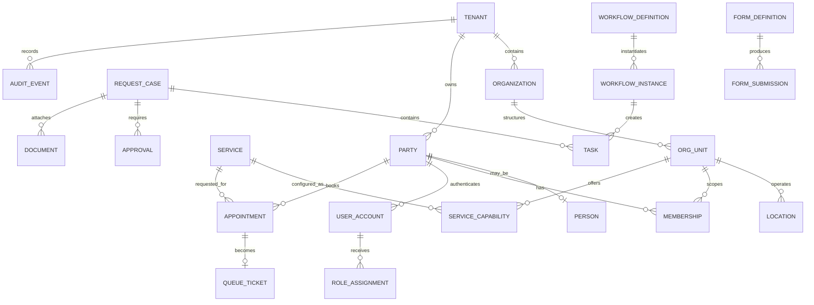

# Canonical Data Model

## Objective

Provide a small set of shared objects so modules interoperate without duplicating customers, employees, branches, documents, cases or decisions.

## Core tenancy and identity objects

| Object | Key fields | Notes |
|---|---|---|
| Tenant | id, name, status, plan, region, locale, settings | Commercial customer boundary. |
| Organization | id, tenant_id, legal_name, type | Legal entity or operating organization. |
| OrgUnit | id, tenant_id, parent_id, type, name | Subsidiary, branch, department, team, cost centre. |
| Location | id, tenant_id, org_unit_id, address, timezone, capabilities | Physical/virtual service location. |
| Party | id, tenant_id, party_type | Shared identity for person or organization. |
| Person | party_id, names, contacts, locale | Base person record; sensitive fields separated. |
| UserAccount | id, party_id, identity_provider_id, status | Login account; a person may have multiple relationships. |
| Membership | user_id/party_id, org_unit_id, relationship, dates | Employee, customer, candidate, partner, vendor contact. |
| RoleAssignment | principal, role, scope, dates, conditions | Role and scope; attributes add policy conditions. |

## Operational objects

| Object | Purpose |
|---|---|
| Service | A bookable/requestable/deliverable organizational service. |
| ServiceCapability | Which branch/team/staff can deliver a service and under what rules. |
| Entitlement | Who is eligible to use a service, feature or plan allowance. |
| Appointment | Reserved service demand with participant, location, slot and status. |
| Queue | Real-time waiting line and routing rules. |
| QueueTicket | Customer demand progressing through one or more service stages. |
| Request/Case | General unit of work with owner, priority, SLA, status and outcome. |
| Task | Human or system work item linked to a case/workflow. |
| Approval | Decision request, approver, policy, outcome and evidence. |
| Comment/Message | Conversation attached to a business object with visibility rules. |

## Configuration objects

| Object | Purpose |
|---|---|
| FormDefinition / FormVersion | Schema, validation, layout, permissions and locale. |
| FormSubmission | Answers, attachments, status and definition version. |
| WorkflowDefinition / WorkflowVersion | States, rules, tasks, timers, actions and escalation. |
| WorkflowInstance | Runtime state linked to a business object. |
| NotificationTemplate | Channel/locale/version-specific content and variables. |
| PolicyRule | Reusable business rule with version and effective dates. |
| FeatureEntitlement | Plan/tenant/module/feature permission and quota. |

## Records and governance objects

| Object | Purpose |
|---|---|
| Document | Metadata, classification, owner, storage reference and retention. |
| DocumentVersion | Immutable file/version details and checksum. |
| Signature | Signer, method, intent, timestamp and evidence. |
| AuditEvent | Actor, tenant, action, object, time, source, reason and outcome. |
| ConsentRecord | Person, purpose, notice version, choice, channel and withdrawal. |
| RetentionRule | Record class, jurisdiction, duration, trigger and disposal action. |
| DataSubjectRequest | Access, correction, export, restriction or deletion workflow. |
| Incident | Severity, impact, responders, timeline, recovery and review. |
| Risk/Control/Evidence | Compliance and risk-management objects. |

## Workforce objects

- EmployeeProfile
- Employment
- Position
- ManagerRelationship
- Shift
- ScheduleAssignment
- AttendanceEvent
- Timesheet
- LeaveType
- LeaveBalance
- LeaveRequest
- OnboardingPlan / OffboardingPlan
- Goal / Review / Feedback

## Talent objects

- JobRequisition
- JobPosting
- CandidateProfile
- Application
- RecruitmentStage
- InterviewPlan
- InterviewSession
- InterviewEvidence
- Assessment
- AccommodationRequest
- HiringDecisionRecord

## Resource and commercial objects

- Vendor
- PurchaseRequest
- PurchaseOrderReference
- Asset
- InventoryItem
- CustodyAssignment
- ExpenseClaim
- TravelRequest
- Contract
- Quote
- Invoice
- PaymentReference
- Subscription
- CustomerAccount
- Relationship/Opportunity

## Integration and AI objects

- IntegrationConnection
- ExternalIdentifier
- SyncJob / SyncError
- WebhookSubscription / Delivery
- APIClient / CredentialReference
- AIUseCase
- AIInteraction
- AIModelRun
- AISourceReference
- AIToolCall
- AIApproval
- AIEvaluation

## Relationship diagram



## Data ownership rules

1. Every tenant-owned table includes `tenant_id` and immutable creation metadata.
2. Global reference data is explicitly marked and read-only to tenants.
3. A domain is the only writer of its authoritative records.
4. Shared read models may combine domains but are rebuildable from source/events.
5. Sensitive fields are separated or encrypted where access patterns require it.
6. Soft deletion is not a substitute for retention/disposal; lifecycle state is explicit.
7. External provider identifiers never replace internal stable IDs.
8. Analytics data preserves tenant and purpose controls and avoids unnecessary personal detail.

## Event envelope

```json
{
  "event_id": "uuid",
  "event_type": "appointment.created.v1",
  "occurred_at": "ISO-8601",
  "tenant_id": "uuid",
  "actor": {"type": "user", "id": "uuid"},
  "subject": {"type": "appointment", "id": "uuid"},
  "correlation_id": "uuid",
  "causation_id": "uuid",
  "schema_version": 1,
  "data": {}
}
```

Events must avoid unnecessary sensitive data; consumers retrieve authorized detail through APIs when needed.
